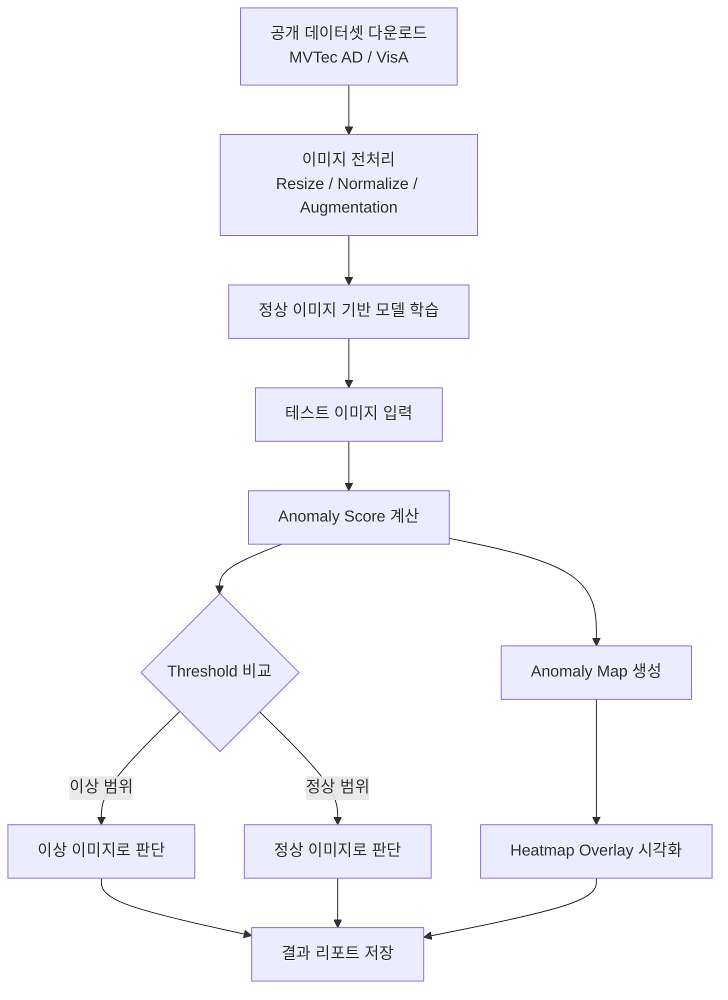
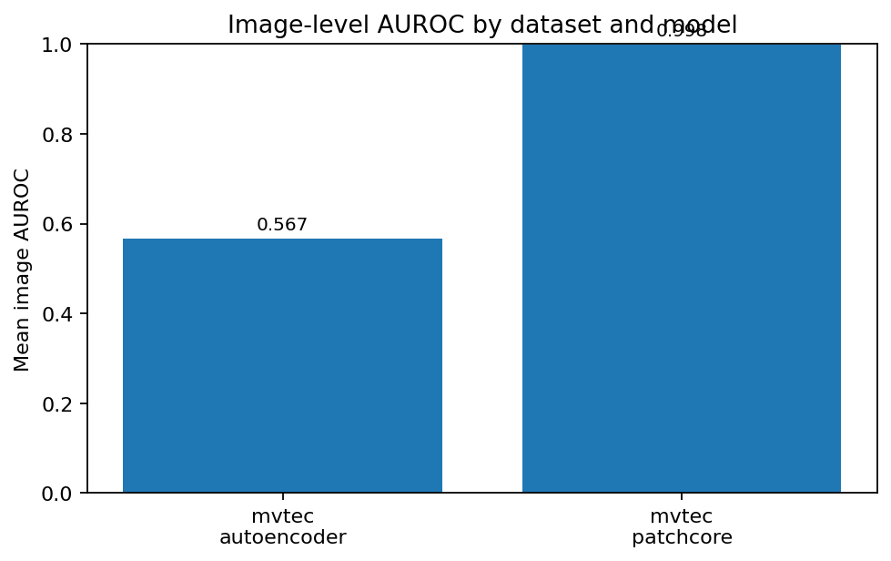

# DefectVision-AD: PyTorch 기반 산업 제품 결함 이상탐지 프로젝트

<p align="center">
  
  
  
  
</p>

> **정상 제품 이미지만 학습한 뒤, 제품 이미지에서 결함 여부와 결함 위치를 탐지하는 PyTorch 기반 산업 이미지 이상탐지 프로젝트입니다.**  
> 본 프로젝트는 직접 영상/이미지를 촬영하지 않고도 공개 데이터셋을 활용해 영상처리, 딥러닝, 이상탐지, 시각화를 모두 경험하는 것을 목표로 합니다.

---

## 목차

- [1. 프로젝트 개요](#1-프로젝트-개요)
- [2. 주제 선정 이유](#2-주제-선정-이유)
- [3. 프로젝트 목표](#3-프로젝트-목표)
- [4. 기대효과](#4-기대효과)
- [5. 자료조사 및 데이터셋 출처](#5-자료조사-및-데이터셋-출처)
- [6. 문제 정의](#6-문제-정의)
- [7. 예상 기술 스택](#7-예상-기술-스택)
- [8. 시스템 구조](#8-시스템-구조)
- [9. 핵심 기능](#9-핵심-기능)
- [10. 모델링 전략](#10-모델링-전략)
- [11. 데이터 전처리 계획](#11-데이터-전처리-계획)
- [12. 평가 지표](#12-평가-지표)
- [13. 예상 결과물](#13-예상-결과물)
- [14. 예상 프로젝트 일정](#14-예상-프로젝트-일정)
- [15. 예상 레포지토리 구조](#15-예상-레포지토리-구조)
- [16. 리스크 및 대응 방안](#16-리스크-및-대응-방안)
- [17. 참고자료](#17-참고자료)

---

<a id="1-프로젝트-개요"></a>
## 1. 프로젝트 개요

| 항목 | 내용 |
|---|---|
| 프로젝트명 | **DefectVision-AD** |
| 주제 | 산업 제품 이미지 기반 결함 이상탐지 |
| 핵심 기술 | 영상처리, 딥러닝, 이상탐지, 결함 위치 시각화 |
| 데이터셋 | MVTec AD, VisA |
| 주요 프레임워크 | PyTorch |
| 주요 모델 후보 | AutoEncoder, PatchCore, PaDiM, FastFlow |
| 최종 결과 | 정상/이상 판별, 이상 점수 산출, 결함 위치 heatmap 시각화 |

본 프로젝트는 제조 공정에서 촬영된 제품 이미지에 대해 **정상 제품과 결함 제품을 구분**하고, 결함이 있는 경우 **어느 영역이 이상인지 시각적으로 표시**하는 것을 목표로 한다.

일반적인 이미지 분류 프로젝트와 달리, 본 프로젝트는 다음과 같은 특징을 가진다.

- 정상 이미지 중심 학습
- 결함 이미지가 적은 상황을 가정
- 제품 단위 이상 여부 판단
- 픽셀 또는 영역 단위 결함 위치 추정
- heatmap 기반 결과 시각화

[맨 위로 이동](#defectvision-ad-pytorch-기반-산업-제품-결함-이상탐지-프로젝트)

---

<a id="2-주제-선정-이유"></a>
## 2. 주제 선정 이유

<details open>
<summary><strong>왜 산업 제품 결함 이상탐지인가?</strong></summary>

### 2.1 현실적인 데이터 확보 가능성

영상처리 프로젝트는 보통 직접 영상을 촬영하거나 데이터를 구축해야 하는 부담이 있다. 그러나 산업 이미지 이상탐지 분야에는 연구 및 교육 목적으로 활용 가능한 공개 데이터셋이 존재한다.

대표적으로 **MVTec AD**와 **VisA**는 정상/이상 이미지와 결함 영역 annotation을 제공하므로, 직접 제품 이미지를 촬영하지 않아도 실험이 가능하다.

### 2.2 영상처리 주제와의 적합성

본 프로젝트는 단순히 이미지를 분류하는 것이 아니라 다음과 같은 영상처리 요소를 포함한다.

- 이미지 크기 정규화
- 색상 공간 변환
- 노이즈 제거
- edge/texture 특징 분석
- anomaly map 생성
- heatmap overlay 시각화
- 결함 영역 segmentation

따라서 “영상처리 기반 머신러닝/딥러닝 이상탐지”라는 요구사항에 적합하다.

### 2.3 구현 가능성

산업 이상탐지는 실제 제조업에서 활용되는 주제이지만, 공개 데이터셋과 오픈소스 라이브러리를 활용하면 충분히 구현할 수 있다.

특히 PyTorch, OpenCV, Anomalib을 사용하면 다음과 같은 단계적 구현이 가능하다.

1. 기본 영상처리 전처리
2. AutoEncoder 기반 baseline 구현
3. PatchCore 또는 PaDiM 기반 성능 개선
4. 결함 위치 heatmap 시각화
5. Streamlit 또는 Gradio 기반 데모 제작

</details>

[맨 위로 이동](#defectvision-ad-pytorch-기반-산업-제품-결함-이상탐지-프로젝트)

---

<a id="3-프로젝트-목표"></a>
## 3. 프로젝트 목표

### 3.1 핵심 목표

> **정상 제품 이미지만 학습한 모델이 테스트 이미지에서 결함 여부를 판별하고, 결함 의심 영역을 heatmap으로 시각화하도록 구현한다.**

### 3.2 세부 목표

- MVTec AD 또는 VisA 데이터셋을 활용한 산업 이미지 이상탐지 실험 환경 구축
- OpenCV 및 TorchVision 기반 이미지 전처리 파이프라인 구현
- PyTorch 기반 AutoEncoder baseline 모델 구현
- PatchCore, PaDiM 등 기존 이상탐지 모델과 성능 비교
- 이미지 단위 anomaly score 산출
- 픽셀 단위 anomaly map 생성
- 결함 위치를 heatmap 형태로 시각화
- 실험 결과를 정량 지표와 시각 자료로 정리
- 사용자가 이미지를 업로드하면 이상 여부를 확인할 수 있는 간단한 데모 구현

[맨 위로 이동](#defectvision-ad-pytorch-기반-산업-제품-결함-이상탐지-프로젝트)

---

<a id="4-기대효과"></a>
## 4. 기대효과

<details>
<summary><strong>기술적 기대효과</strong></summary>

- PyTorch 기반 컴퓨터비전 모델 구현 경험 확보
- 정상 데이터 중심의 one-class anomaly detection 개념 이해
- 이미지 분류와 segmentation의 차이 이해
- anomaly score, anomaly map, heatmap 생성 과정 이해
- OpenCV 기반 영상처리 전처리 능력 향상
- 실제 산업 비전 검사와 유사한 프로젝트 경험 확보

</details>

<details>
<summary><strong>실무적 기대효과</strong></summary>

- 제조 공정 품질 검사 자동화에 적용 가능한 아이디어 도출
- 사람이 육안으로 검사하기 어려운 미세 결함 탐지 가능성 확인
- 결함 위치 시각화를 통해 모델 판단 근거 설명 가능
- 불량 검출 자동화 시스템의 프로토타입 제작 가능

</details>

<details>
<summary><strong>학습 및 포트폴리오 기대효과</strong></summary>

- 단순 분류 모델보다 완성도 높은 컴퓨터비전 포트폴리오 제작 가능
- 데이터 전처리, 모델 학습, 평가, 시각화, 데모까지 end-to-end 경험 가능
- GitHub README만으로 프로젝트 의도와 구조를 명확히 보여줄 수 있음
- 향후 졸업작품, 캡스톤디자인, AI 포트폴리오 프로젝트로 확장 가능

</details>

[맨 위로 이동](#defectvision-ad-pytorch-기반-산업-제품-결함-이상탐지-프로젝트)

---

<a id="5-자료조사-및-데이터셋-출처"></a>
## 5. 자료조사 및 데이터셋 출처

### 5.1 MVTec AD

| 항목 | 내용 |
|---|---|
| 정식 명칭 | MVTec Anomaly Detection Dataset |
| 목적 | 산업 검사 환경의 이상탐지 benchmark |
| 데이터 구성 | 15개 object/texture category |
| 이미지 수 | 5,000장 이상의 고해상도 이미지 |
| 학습 데이터 | 결함 없는 정상 이미지 중심 |
| 테스트 데이터 | 정상 이미지와 다양한 결함 이미지 포함 |
| annotation | 결함 영역 ground truth mask 제공 |
| 공식 출처 | [MVTec AD 공식 페이지](https://www.mvtec.com/research-teaching/datasets/mvtec-ad) |

MVTec AD는 산업 검사 환경을 목표로 구성된 대표적인 이상탐지 데이터셋이다. 각 category는 결함 없는 학습 이미지와 정상/이상 테스트 이미지로 구성되어 있어, **정상 데이터만으로 학습한 뒤 결함을 탐지하는 실험**에 적합하다.

### 5.2 VisA

| 항목 | 내용 |
|---|---|
| 정식 명칭 | Visual Anomaly Dataset |
| 목적 | 산업 제품 이미지 기반 이상탐지 및 segmentation |
| 데이터 구성 | 12개 object class, 3개 domain |
| 이미지 수 | 총 10,821장 |
| 정상 이미지 | 9,621장 |
| 이상 이미지 | 1,200장 |
| annotation | image-level 및 pixel-level annotation 제공 |
| 공식 출처 | [AWS Open Data Registry - VisA](https://registry.opendata.aws/visa/) |

VisA는 MVTec AD보다 이미지 수가 많고 여러 제품 class를 포함한다. 정상/이상 이미지와 픽셀 단위 annotation을 제공하므로, 이미지 단위 분류와 결함 위치 탐지를 함께 실험할 수 있다.

### 5.3 Anomalib

| 항목 | 내용 |
|---|---|
| 정식 명칭 | Anomalib |
| 목적 | Visual anomaly detection 모델 개발 및 benchmark 지원 |
| 주요 기능 | 데이터셋 로딩, 모델 학습, 평가, 시각화, 배포 지원 |
| 관련 모델 | PatchCore, PaDiM, FastFlow 등 |
| 공식 출처 | [Anomalib GitHub](https://github.com/open-edge-platform/anomalib) |
| 문서 | [Anomalib Documentation](https://anomalib.readthedocs.io/) |

Anomalib은 이미지 또는 영상 데이터에서 이상을 탐지하고 위치를 추정하는 visual anomaly detection에 초점을 둔 오픈소스 라이브러리다. 본 프로젝트에서는 직접 구현한 baseline과 Anomalib 기반 모델을 비교하는 방식으로 활용할 수 있다.

### 5.4 PatchCore

| 항목 | 내용 |
|---|---|
| 모델명 | PatchCore |
| 핵심 아이디어 | 정상 이미지의 patch feature를 memory bank에 저장하고, 테스트 이미지 patch와 비교 |
| 장점 | 산업 이미지 이상탐지에서 강력한 baseline으로 활용 가능 |
| 공식 문서 | [Anomalib PatchCore Documentation](https://anomalib.readthedocs.io/en/v2.0.0/markdown/guides/reference/models/image/patchcore.html) |

PatchCore는 사전학습 CNN backbone에서 추출한 patch feature를 저장하고, 테스트 이미지의 patch가 정상 feature와 얼마나 다른지를 계산하여 이상을 탐지한다.

[맨 위로 이동](#defectvision-ad-pytorch-기반-산업-제품-결함-이상탐지-프로젝트)

---

<a id="6-문제-정의"></a>
## 6. 문제 정의

### 6.1 입력

- 제품 이미지 1장
- 또는 제품 이미지 batch

### 6.2 출력

- 이미지 단위 정상/이상 예측 결과
- anomaly score
- 결함 의심 영역 heatmap
- 결함 영역 binary mask
- 원본 이미지 + heatmap overlay 결과

### 6.3 문제 유형

| 관점 | 문제 유형 |
|---|---|
| 머신러닝 관점 | Unsupervised / One-Class Anomaly Detection |
| 컴퓨터비전 관점 | Image Classification + Defect Localization |
| 영상처리 관점 | Texture/Edge/Region 기반 이미지 분석 및 시각화 |

### 6.4 핵심 가정

- 실제 산업 현장에서는 결함 데이터보다 정상 데이터가 훨씬 많다.
- 따라서 정상 패턴을 학습한 뒤 정상에서 벗어난 영역을 이상으로 판단한다.
- 단순히 “불량/정상”만 맞히는 것이 아니라, “왜 불량인지”를 시각적으로 보여주는 것이 중요하다.

[맨 위로 이동](#defectvision-ad-pytorch-기반-산업-제품-결함-이상탐지-프로젝트)

---

<a id="7-예상-기술-스택"></a>
## 7. 예상 기술 스택

> 아래 명칭은 프로젝트 진행 중 변경 가능하다.

| 구분 | 기술 후보 | 사용 목적 |
|---|---|---|
| Language | Python | 전체 프로젝트 개발 |
| Deep Learning | PyTorch | 모델 구현 및 학습 |
| Vision Utility | TorchVision | transform, backbone, 이미지 처리 |
| Image Processing | OpenCV | 이미지 전처리, heatmap overlay |
| Data Handling | NumPy, Pandas | 수치 연산 및 실험 결과 정리 |
| Visualization | Matplotlib, Seaborn | 성능 그래프 및 결과 시각화 |
| Model Library | Anomalib | 이상탐지 모델 benchmark |
| Experiment Tracking | TensorBoard 또는 MLflow | 학습 로그 및 실험 관리 |
| Demo | Streamlit 또는 Gradio | 사용자 이미지 업로드 데모 |
| Environment | Conda 또는 venv | Python 환경 관리 |
| Version Control | Git, GitHub | 코드 및 문서 관리 |

### 7.1 최소 구현 스택

```text
Python
PyTorch
TorchVision
OpenCV
NumPy
Matplotlib
scikit-learn
```

### 7.2 확장 구현 스택

```text
Anomalib
PyTorch Lightning
Streamlit
MLflow
Weights & Biases
```

[맨 위로 이동](#defectvision-ad-pytorch-기반-산업-제품-결함-이상탐지-프로젝트)

---

<a id="8-시스템-구조"></a>
## 8. 시스템 구조



### 8.1 전체 처리 흐름

1. MVTec AD 또는 VisA 데이터셋 준비
2. train/test 데이터 분리 확인
3. 이미지 resize 및 normalize
4. 정상 이미지 중심 모델 학습
5. 테스트 이미지 입력
6. anomaly score 계산
7. threshold 기반 정상/이상 판별
8. anomaly map 생성
9. heatmap overlay 결과 저장
10. 평가 지표 계산 및 결과 분석

[맨 위로 이동](#defectvision-ad-pytorch-기반-산업-제품-결함-이상탐지-프로젝트)

---

<a id="9-핵심-기능"></a>
## 9. 핵심 기능

<details open>
<summary><strong>1. 데이터셋 로딩 기능</strong></summary>

- MVTec AD 데이터셋 구조 자동 인식
- VisA 데이터셋 구조 자동 인식
- category별 데이터셋 선택 기능
- train/test split 로딩
- ground truth mask 로딩

</details>

<details open>
<summary><strong>2. 이미지 전처리 기능</strong></summary>

- 이미지 resize
- RGB 변환
- normalization
- grayscale 변환 옵션
- Gaussian blur, edge detection 등 OpenCV 기반 전처리 옵션
- augmentation 적용 여부 설정

</details>

<details open>
<summary><strong>3. 이상탐지 모델 학습 기능</strong></summary>

- AutoEncoder baseline 학습
- reconstruction error 기반 anomaly score 계산
- PatchCore 또는 PaDiM 모델 학습 및 추론
- 모델별 실험 결과 비교

</details>

<details open>
<summary><strong>4. 결함 위치 시각화 기능</strong></summary>

- anomaly map 생성
- threshold 기반 binary mask 생성
- heatmap overlay 이미지 생성
- 원본 이미지, ground truth, prediction 비교 이미지 저장

</details>

<details open>
<summary><strong>5. 데모 기능</strong></summary>

- 사용자가 제품 이미지를 업로드
- 모델이 정상/이상 여부 예측
- anomaly score 출력
- heatmap 결과 이미지 출력

</details>

[맨 위로 이동](#defectvision-ad-pytorch-기반-산업-제품-결함-이상탐지-프로젝트)

---

<a id="10-모델링-전략"></a>
## 10. 모델링 전략

### 10.1 Baseline: AutoEncoder

AutoEncoder는 입력 이미지를 압축한 뒤 다시 복원하는 구조를 가진다. 정상 이미지만 학습하면 정상 이미지는 잘 복원하지만, 결함 이미지는 상대적으로 복원이 어렵다.

따라서 다음 값을 anomaly score로 활용할 수 있다.

```text
Anomaly Score = Original Image와 Reconstructed Image의 차이
```

#### 장점

- 직접 구현하기 쉬움
- 이상탐지 원리를 설명하기 좋음
- 프로젝트 baseline으로 적합

#### 단점

- 복잡한 texture 결함에서는 성능이 낮을 수 있음
- 결함 영역 localization 품질이 제한적일 수 있음

---

### 10.2 개선 모델: PatchCore

PatchCore는 정상 이미지에서 추출한 patch feature를 memory bank에 저장하고, 테스트 이미지 patch가 정상 patch와 얼마나 다른지를 계산한다.

#### 장점

- 산업 이미지 이상탐지에서 강력한 baseline
- 학습 방식이 비교적 단순함
- anomaly map 생성에 적합

#### 단점

- feature memory bank 관리 필요
- 데이터와 backbone에 따라 추론 속도 차이가 발생할 수 있음

---

### 10.3 비교 후보: PaDiM, FastFlow

| 모델 | 개념 | 활용 목적 |
|---|---|---|
| AutoEncoder | 복원 오차 기반 | 직접 구현 baseline |
| PatchCore | patch feature memory bank 기반 | 성능 개선 모델 |
| PaDiM | pretrained feature의 분포 모델링 | 통계 기반 비교 모델 |
| FastFlow | normalizing flow 기반 | 고급 모델 비교 후보 |

[맨 위로 이동](#defectvision-ad-pytorch-기반-산업-제품-결함-이상탐지-프로젝트)

---

<a id="11-데이터-전처리-계획"></a>
## 11. 데이터 전처리 계획

### 11.1 기본 전처리

| 단계 | 설명 |
|---|---|
| 이미지 로딩 | PIL 또는 OpenCV 사용 |
| 크기 통일 | 224x224 또는 256x256 |
| 색상 변환 | BGR to RGB |
| 정규화 | ImageNet mean/std 또는 dataset mean/std |
| tensor 변환 | PyTorch Tensor 변환 |

### 11.2 선택 전처리

| 기법 | 목적 |
|---|---|
| Grayscale | 색상보다 texture가 중요한 경우 사용 |
| Gaussian Blur | 노이즈 완화 |
| Canny Edge | 결함 경계 강조 |
| Histogram Equalization | 명암 대비 개선 |
| Random Crop | 일반화 성능 향상 |
| Rotation/Flip | 데이터 다양성 확보 |

### 11.3 전처리 비교 실험

다음 실험을 통해 전처리 방식에 따른 성능 차이를 비교한다.

```text
Experiment 1: RGB 원본 이미지
Experiment 2: Grayscale 이미지
Experiment 3: Edge 강조 이미지
Experiment 4: Augmentation 적용 이미지
```

[맨 위로 이동](#defectvision-ad-pytorch-기반-산업-제품-결함-이상탐지-프로젝트)

---

<a id="12-평가-지표"></a>
## 12. 평가 지표

### 12.1 Image-level 평가

| 지표 | 설명 |
|---|---|
| Accuracy | 전체 이미지 중 정상/이상 분류가 맞은 비율 |
| Precision | 이상으로 예측한 이미지 중 실제 이상 이미지 비율 |
| Recall | 실제 이상 이미지 중 모델이 이상으로 탐지한 비율 |
| F1-score | Precision과 Recall의 조화 평균 |
| AUROC | threshold 변화에 따른 분류 성능 평가 |

### 12.2 Pixel-level 평가

| 지표 | 설명 |
|---|---|
| Pixel AUROC | 픽셀 단위 정상/이상 구분 성능 |
| IoU | 예측 결함 영역과 실제 결함 영역의 겹침 정도 |
| PRO Score | 결함 영역 단위 localization 성능 평가 |

### 12.3 시각화 평가

정량 지표뿐 아니라 다음 시각 자료를 함께 제시한다.

- 원본 이미지
- ground truth mask
- anomaly map
- heatmap overlay
- threshold 적용 binary mask

[맨 위로 이동](#defectvision-ad-pytorch-기반-산업-제품-결함-이상탐지-프로젝트)

---

<a id="13-예상-결과물"></a>
## 13. 예상 결과물

### 13.1 GitHub 결과물

- 프로젝트 README
- 데이터셋 준비 가이드
- 학습 코드
- 추론 코드
- 평가 코드
- 시각화 코드
- 실험 결과 이미지
- 데모 실행 방법

### 13.2 모델 결과물

- 학습된 AutoEncoder 모델
- PatchCore 또는 PaDiM 실험 결과
- category별 성능 비교표
- 정상/이상 예측 결과 CSV
- anomaly score 분포 그래프
- heatmap 결과 이미지

### 13.3 데모 결과물

- 이미지 업로드 기능
- 정상/이상 예측 결과 출력
- anomaly score 표시
- 결함 위치 heatmap 출력

[맨 위로 이동](#defectvision-ad-pytorch-기반-산업-제품-결함-이상탐지-프로젝트)

---

<a id="14-예상-프로젝트-일정"></a>
## 14. 예상 프로젝트 일정

| 주차 | 작업 내용 |
|---|---|
| 1주차 | 자료조사, 데이터셋 구조 파악, 개발 환경 구축 |
| 2주차 | 데이터 로더 및 전처리 파이프라인 구현 |
| 3주차 | AutoEncoder baseline 구현 및 학습 |
| 4주차 | anomaly score 계산 및 heatmap 시각화 구현 |
| 5주차 | PatchCore 또는 PaDiM 모델 적용 |
| 6주차 | 모델 성능 비교 및 평가 지표 정리 |
| 7주차 | Streamlit/Gradio 데모 구현 |
| 8주차 | README, 발표자료, 최종 보고서 정리 |

[맨 위로 이동](#defectvision-ad-pytorch-기반-산업-제품-결함-이상탐지-프로젝트)

---

<a id="15-예상-레포지토리-구조"></a>
## 15. 예상 레포지토리 구조

```text
DefectVision-AD/
├── README.md
├── requirements.txt
├── .gitignore
├── configs/
│   ├── dataset.yaml
│   ├── model_autoencoder.yaml
│   └── model_patchcore.yaml
├── data/
│   ├── raw/
│   ├── processed/
│   └── README.md
├── notebooks/
│   ├── 01_dataset_exploration.ipynb
│   ├── 02_preprocessing_test.ipynb
│   └── 03_result_visualization.ipynb
├── src/
│   ├── datasets/
│   │   ├── mvtec_dataset.py
│   │   └── visa_dataset.py
│   ├── models/
│   │   ├── autoencoder.py
│   │   └── patchcore_wrapper.py
│   ├── preprocessing/
│   │   └── transforms.py
│   ├── train.py
│   ├── inference.py
│   ├── evaluate.py
│   └── visualize.py
├── app/
│   └── streamlit_app.py
├── outputs/
│   ├── checkpoints/
│   ├── heatmaps/
│   ├── metrics/
│   └── figures/
└── docs/
    ├── project_plan.md
    └── experiment_report.md
```

[맨 위로 이동](#defectvision-ad-pytorch-기반-산업-제품-결함-이상탐지-프로젝트)

---

<a id="16-리스크-및-대응-방안"></a>
## 16. 리스크 및 대응 방안

| 리스크 | 설명 | 대응 방안 |
|---|---|---|
| 데이터셋 용량 문제 | 고해상도 이미지로 인해 저장 공간 필요 | 일부 category부터 실험 |
| GPU 부족 | 모델 학습 시간이 길어질 수 있음 | 이미지 크기 축소, batch size 조정, Colab 활용 |
| 모델 성능 부족 | AutoEncoder 성능이 낮을 수 있음 | PatchCore, PaDiM 등 feature 기반 모델 추가 |
| 전처리 효과 불명확 | 전처리에 따라 성능이 달라질 수 있음 | 전처리별 ablation study 진행 |
| 평가 지표 이해 어려움 | AUROC, PRO Score 등 해석 필요 | image-level 지표부터 적용 후 pixel-level로 확장 |
| 라이선스 문제 | 데이터셋별 사용 조건 확인 필요 | 공식 페이지의 license 및 terms 확인 후 사용 |

[맨 위로 이동](#defectvision-ad-pytorch-기반-산업-제품-결함-이상탐지-프로젝트)

---

<a id="17-참고자료"></a>
## 17. 참고자료

### Dataset

- [MVTec AD 공식 페이지](https://www.mvtec.com/research-teaching/datasets/mvtec-ad)
- [AWS Open Data Registry - Visual Anomaly Dataset, VisA](https://registry.opendata.aws/visa/)
- [Anomalib VisA Dataset Documentation](https://anomalib.readthedocs.io/en/v1/markdown/guides/reference/data/image/visa.html)

### Library / Framework

- [PyTorch 공식 문서](https://pytorch.org/docs/stable/index.html)
- [TorchVision Transforms 공식 문서](https://docs.pytorch.org/vision/stable/transforms.html)
- [OpenCV 공식 문서](https://docs.opencv.org/)
- [Anomalib GitHub](https://github.com/open-edge-platform/anomalib)
- [Anomalib Documentation](https://anomalib.readthedocs.io/)

### Model

- [PatchCore - Anomalib Documentation](https://anomalib.readthedocs.io/en/v2.0.0/markdown/guides/reference/models/image/patchcore.html)

---

## License Notice

본 프로젝트는 학습 및 연구 목적의 프로젝트 기획안이다. 데이터셋 사용 전 각 데이터셋의 공식 license와 terms를 반드시 확인해야 한다.

---

## 한 줄 요약

> **DefectVision-AD는 공개 산업 이미지 데이터셋을 활용하여 제품 결함 여부와 결함 위치를 탐지하는 PyTorch 기반 영상처리 이상탐지 프로젝트입니다.**

[맨 위로 이동](#defectvision-ad-pytorch-기반-산업-제품-결함-이상탐지-프로젝트)


<!-- DEFECTVISION_RESULTS_START -->
## 실험 결과: MVTec AD + VisA

> Colab에서 MVTec AD와 VisA의 category별 모델을 학습/평가한 결과입니다. 대용량 checkpoint와 원본 데이터는 Google Drive에 보관하고, GitHub에는 README용 CSV/PNG 산출물만 저장합니다.

### 모델 선택 기준

정확도만 기준으로 고르면 class imbalance가 있는 anomaly detection에서 모델을 잘못 선택할 수 있으므로, 아래 가중 평균을 사용했습니다.

```text
selection_score = 0.40*AUROC + 0.25*F1 + 0.25*Pixel_AUROC + 0.10*Accuracy
계산 불가능한 지표는 제외하고 남은 지표의 가중치 합으로 재정규화
```

### 성능 시각화

#### 모델별 평균 선택 점수


#### 데이터셋/모델별 평균 image AUROC


#### category별 최고 모델


#### category × model 선택 점수 heatmap


### Top 10 Leaderboard

| Rank | Dataset | Category | Model | Selection | Accuracy | Precision | Recall | F1 | AUROC | Pixel AUROC |
|---:|---|---|---|---:|---:|---:|---:|---:|---:|---:|
| 1 | mvtec | bottle | patchcore | 0.990 | 0.988 | 1.000 | 0.984 | 0.992 | 0.998 | 0.977 |
| 2 | mvtec | bottle | autoencoder | 0.547 | 0.506 | 0.806 | 0.460 | 0.586 | 0.567 | 0.493 |

### Heatmap sample panels


### 저장된 산출물

- `docs/assets/results/all_results.csv`: 전체 실험 결과
- `docs/assets/results/leaderboard.csv`: selection score 기준 전체 순위
- `docs/assets/results/best_by_category.csv`: category별 최고 모델
- `docs/assets/results/*.png`: README용 성능 그래프
- `docs/assets/results/samples/*.png`: heatmap sample panel
<!-- DEFECTVISION_RESULTS_END -->
