# DefectVision-AD 최종 보고서

<p align="center">
  
  
  
  
  
</p>

> 정상 제품 이미지만 학습한 뒤, 제품 이미지가 정상인지 불량인지 판별하고 결함 의심 영역을 heatmap으로 시각화하는 PyTorch 기반 산업 이미지 이상탐지 프로젝트입니다.

---

## 제출 정보

| 항목 | 내용 |
|---|---|
| 학교 | 인하공업전문대학 |
| 학과 | 컴퓨터정보공학과(심화) |
| 학년 | 1학년 |
| 학번 | 202647025 |
| 이름 | 김준섭 |
| 프로젝트명 | DefectVision-AD |
| GitHub | https://github.com/wnstjq0915/DefectVision-AD-Proj.git |
| 최종 실험 데이터셋 | MVTec AD |
| 최종 실험 category | bottle, cable, capsule, carpet, grid, hazelnut |

---

## 목차

1. [문제 정의](#1-문제-정의)
2. [데이터셋 설명](#2-데이터셋-설명)
3. [데이터 분할: train / validation / test](#3-데이터-분할-train--validation--test)
4. [시스템 구조](#4-시스템-구조)
5. [사용 모델 설명](#5-사용-모델-설명)
6. [전처리 및 학습 설정](#6-전처리-및-학습-설정)
7. [성능 비교 방법](#7-성능-비교-방법)
8. [실험 결과](#8-실험-결과)
9. [학습 로그](#9-학습-로그)
10. [Streamlit 데모 및 AWS EC2 배포](#10-streamlit-데모-및-aws-ec2-배포)
11. [코드 구조](#11-코드-구조)
12. [프로젝트 한계와 개선 방향](#12-프로젝트-한계와-개선-방향)
13. [PDF 제출 방법](#13-pdf-제출-방법)
14. [참고 자료](#14-참고-자료)

---

## 1. 문제 정의

### 1.1 문제 배경

제조 공정에서는 제품 표면의 흠집, 오염, 파손, 형태 변형 등을 빠르게 탐지해야 한다. 그러나 모든 결함 유형을 사전에 충분히 수집하기는 어렵고, 실제 산업 현장에서는 정상 제품 데이터가 불량 제품 데이터보다 훨씬 많다. 따라서 본 프로젝트는 **정상 이미지 중심 학습(one-class / unsupervised anomaly detection)** 관점에서 제품 결함 여부를 판정하는 문제를 다룬다.

### 1.2 입력과 출력

| 구분 | 내용 |
|---|---|
| 입력 | 제품 이미지 1장 또는 batch |
| 출력 1 | 이미지 단위 정상/불량 예측 결과 |
| 출력 2 | anomaly score |
| 출력 3 | anomaly map |
| 출력 4 | heatmap overlay |
| 출력 5 | threshold 기반 binary mask |

### 1.3 문제 유형

| 관점 | 문제 유형 |
|---|---|
| 머신러닝 | Unsupervised / One-Class Anomaly Detection |
| 컴퓨터비전 | Image-level Classification + Pixel-level Localization |
| 영상처리 | Resize, Normalize, Heatmap, Mask, Overlay Visualization |

본 프로젝트의 핵심은 단순히 정상/불량을 맞히는 것뿐 아니라, 모델이 어느 영역을 결함으로 의심했는지를 heatmap으로 설명하는 것이다.

---

## 2. 데이터셋 설명

### 2.1 사용 데이터셋

최종 실험에는 **MVTec AD(MVTec Anomaly Detection Dataset)** 를 사용하였다. MVTec AD는 산업 제품 및 texture 이미지에 대해 정상 이미지, 불량 이미지, pixel-level ground truth mask를 제공하는 대표적인 이상탐지 benchmark 데이터셋이다.

초기 프로젝트 계획에는 MVTec AD와 VisA를 모두 고려하였으나, 학습 시간, Colab GPU 사용 시간, EC2 배포 용량을 고려하여 최종 보고서 실험은 MVTec AD의 6개 category에 집중하였다.

| 항목 | 내용 |
|---|---|
| 데이터셋명 | MVTec AD |
| 공식 출처 | https://www.mvtec.com/research-teaching/datasets/mvtec-ad |
| 전체 구성 | 15개 object/texture category |
| 최종 사용 category | bottle, cable, capsule, carpet, grid, hazelnut |
| 학습 데이터 | 정상 이미지(`train/good`) 중심 |
| 테스트 데이터 | 정상 이미지(`test/good`) + 결함 이미지(`test/<defect_type>`) |
| 결함 위치 annotation | `ground_truth/<defect_type>` mask 제공 |

### 2.2 최종 사용 category 선정 이유

MVTec AD 전체 15개 category를 모두 학습할 경우 AutoEncoder 장기 학습과 PatchCore memory bank 생성 시간이 길어져 Colab 런타임 제한에 걸릴 가능성이 높았다. 따라서 대표적인 object/texture category가 섞이도록 다음 6개 category를 선택하였다.

- `bottle`: 객체형 제품, 파손/오염 결함
- `cable`: 선형 구조가 복잡한 객체형 제품
- `capsule`: 작고 둥근 제품, 인쇄/균열/눌림 결함
- `carpet`: texture 기반 표면 결함
- `grid`: 반복 패턴 기반 texture 결함
- `hazelnut`: 자연물 형태 객체, 균열/절단/구멍 결함

---

## 3. 데이터 분할: train / validation / test

MVTec AD는 기본적으로 `train`과 `test` split을 제공한다. 본 프로젝트에서는 다음 방식으로 사용하였다.

- `train/good`: 정상 이미지만 사용
- `validation`: `train/good` 중 15%를 validation으로 분리
- `test/good`: 정상 테스트 이미지
- `test/<defect_type>`: 불량 테스트 이미지
- `ground_truth/<defect_type>`: pixel-level localization 평가용 mask

### 3.1 Category별 데이터 수

| Category | Train good | Validation good | Test good | Test anomaly | Test total | Defect types |
|---|---:|---:|---:|---:|---:|---|
| `bottle` | 209 | 31 | 20 | 63 | 83 | broken_large, broken_small, contamination |
| `cable` | 224 | 34 | 58 | 92 | 150 | bent_wire, cable_swap, combined, cut_inner_insulation, cut_outer_insulation, missing_cable, missing_wire, poke_insulation |
| `capsule` | 219 | 33 | 23 | 109 | 132 | crack, faulty_imprint, poke, scratch, squeeze |
| `carpet` | 280 | 42 | 28 | 89 | 117 | color, cut, hole, metal_contamination, thread |
| `grid` | 264 | 40 | 21 | 57 | 78 | bent, broken, glue, metal_contamination, thread |
| `hazelnut` | 391 | 59 | 40 | 70 | 110 | crack, cut, hole, print |

### 3.2 데이터 사용 방식

| 데이터 구분 | 사용 목적 |
|---|---|
| Train | 정상 패턴 학습, AutoEncoder 복원 학습, PatchCore memory bank 구성 |
| Validation | AutoEncoder early stopping 및 best epoch 선택 |
| Test | 최종 성능 평가, README/Streamlit용 시각화 생성 |

---

## 4. 시스템 구조

### 4.1 전체 처리 흐름

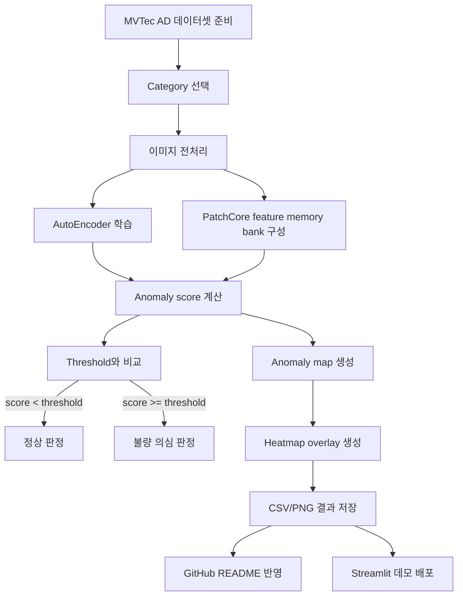

### 4.2 모델 추론 구조

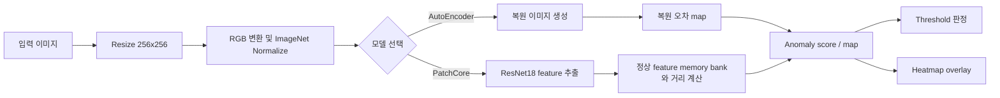

---

## 5. 사용 모델 설명

본 프로젝트에서는 직접 구현한 **AutoEncoder**와 경량 구현한 **PatchCore-style model**을 비교하였다.

### 5.1 AutoEncoder

AutoEncoder는 입력 이미지를 encoder로 압축한 뒤 decoder로 다시 복원하는 구조이다. 정상 이미지만 학습하면 정상 이미지는 잘 복원하지만, 결함이 있는 이미지는 정상 패턴과 달라 복원 오차가 커진다는 가정을 사용한다.

#### 구조

```mermaid
flowchart LR
    A[Input image 3x256x256] --> B[ConvBlock 3→32 stride 2]
    B --> C[ConvBlock 32→64 stride 2]
    C --> D[ConvBlock 64→128 stride 2]
    D --> E[ConvBlock 128→256 latent]
    E --> F[DeconvBlock 256→128]
    F --> G[DeconvBlock 128→64]
    G --> H[DeconvBlock 64→32]
    H --> I[ConvTranspose + Conv2d]
    I --> J[Reconstructed image]
    J --> K[Original과 MSE 비교]
```

#### 특징

| 항목 | 내용 |
|---|---|
| 학습 방식 | 정상 이미지 복원 학습 |
| Pretrained weight | 사용하지 않음 |
| Transfer Learning | 사용하지 않음 |
| 학습 시작 | 처음부터 학습(from scratch) |
| anomaly score | 원본 이미지와 복원 이미지의 MSE reconstruction error |
| anomaly map | pixel-wise reconstruction error map |
| 장점 | 구조가 단순하고 이상탐지 원리 설명이 쉬움 |
| 단점 | 복잡한 texture나 미세 결함에서는 불량을 정상처럼 복원할 수 있음 |

### 5.2 PatchCore-style model

PatchCore는 정상 이미지에서 추출한 patch-level feature를 memory bank에 저장하고, 테스트 이미지의 patch feature가 정상 feature와 얼마나 다른지 거리로 계산하는 방식이다. 본 프로젝트에서는 `torchvision.models.resnet18`의 중간 feature를 이용한 경량 PatchCore wrapper를 구현하였다.

#### 구조

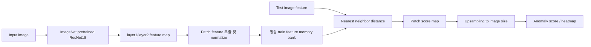

#### 특징

| 항목 | 내용 |
|---|---|
| 학습 방식 | 정상 이미지 feature memory bank 구축 |
| Pretrained weight | 사용함 |
| Backbone | ResNet18 |
| Transfer Learning | ImageNet pretrained CNN feature를 산업 이미지 이상탐지에 활용 |
| 신경망 weight 업데이트 | 없음. Feature extractor는 eval 모드로 사용 |
| anomaly score | test patch와 memory bank patch 간 최근접 거리의 최대값 |
| anomaly map | patch distance map을 원본 이미지 크기로 upsampling |
| 장점 | 산업 이상탐지에서 강한 성능, localization에 유리 |
| 단점 | memory bank 크기와 feature 거리 계산 때문에 추론 비용이 증가할 수 있음 |

### 5.3 모델 구조 및 학습 방식 변경

| 구분 | AutoEncoder baseline | 최종 AutoEncoder 실험 | PatchCore 실험 |
|---|---|---|---|
| 모델 구조 | Conv AutoEncoder | 동일 구조 유지 | ResNet18 feature extractor + memory bank |
| 학습 안정화 | 단순 epoch 반복 | validation split, early stopping, LR scheduler, weight decay, augmentation, resume checkpoint 적용 | 별도 gradient 학습 없음 |
| Pretrained | 없음 | 없음 | ImageNet pretrained ResNet18 사용 |
| Threshold | train score p95 | train score p95 | train score p95 |
| 결과 | baseline 비교 | 과적합 방지 포함 baseline | 최종 최고 성능 모델 |

---

## 6. 전처리 및 학습 설정

### 6.1 공통 전처리

| 단계 | 설정 |
|---|---|
| 이미지 로딩 | PIL 기반 RGB 변환 |
| 이미지 크기 | 256 × 256 |
| Tensor 변환 | CHW float tensor |
| Normalization | ImageNet mean/std: `[0.485, 0.456, 0.406]`, `[0.229, 0.224, 0.225]` |
| Mask 처리 | ground truth mask를 256 × 256으로 resize, binary tensor화 |
| 선택 전처리 | grayscale, gaussian blur, canny, histogram equalization 옵션 구현 |
| 실제 최종 실험 | RGB + Resize + Normalize 사용 |

### 6.2 AutoEncoder 학습 parameter

| 항목 | 값 |
|---|---:|
| image size | 256 |
| batch size | 8 |
| max epoch | 80 |
| min epoch | 20 |
| validation ratio | 0.15 |
| learning rate | 0.0005 |
| optimizer | AdamW |
| weight decay | 0.0001 |
| loss | MSELoss |
| early stopping patience | 4 |
| early stopping min delta | 1e-5 |
| LR scheduler | ReduceLROnPlateau |
| scheduler factor | 0.5 |
| scheduler patience | 4 |
| gradient clipping | max norm 1.0 |
| augmentation | random horizontal flip, random vertical flip |
| AMP | CUDA 사용 시 mixed precision 사용 |
| resume checkpoint | 10 epoch마다 Drive에 저장 |
| threshold | train score의 95 percentile |

### 6.3 PatchCore 학습 parameter

| 항목 | 값 |
|---|---:|
| image size | 256 |
| batch size | 4 |
| backbone | ResNet18 |
| pretrained | True |
| max memory patches | 50,000 |
| feature layer | conv1, bn1, relu, maxpool, layer1, layer2 |
| feature normalization | L2 normalize |
| distance | Euclidean distance via `torch.cdist` |
| threshold | train score의 95 percentile |

### 6.4 학습 환경

| 항목 | 내용 |
|---|---|
| 학습 환경 | Google Colab |
| 저장소 | Google Drive |
| 배포 환경 | AWS EC2 + Streamlit |
| 버전 관리 | GitHub |
| Colab 안정화 | `num_workers=0`, 완료 항목 skip, resume checkpoint 사용 |

---

## 7. 성능 비교 방법

### 7.1 평가 기준

이미지 단위 분류 성능과 pixel 단위 localization 성능을 함께 비교하였다.

| 지표 | 의미 |
|---|---|
| Threshold | anomaly score를 정상/불량으로 나누는 기준값 |
| Accuracy | 전체 test 이미지 중 정상/불량 판정을 맞힌 비율 |
| Precision | 불량으로 예측한 이미지 중 실제 불량 비율 |
| Recall | 실제 불량 이미지 중 모델이 불량으로 탐지한 비율 |
| F1-score | Precision과 Recall의 조화 평균 |
| AUROC | threshold 변화에 따른 image-level 분류 성능 |
| Pixel AUROC | ground truth mask 기준 pixel-level 결함 위치 탐지 성능 |

### 7.2 종합 모델 선택 점수

불균형 데이터에서는 Accuracy만으로 모델을 선택하면 불량 탐지 성능을 잘못 판단할 수 있다. 따라서 본 프로젝트는 다음 가중 평균을 사용하였다.

```text
selection_score = 0.40 × AUROC + 0.25 × F1 + 0.25 × Pixel_AUROC + 0.10 × Accuracy
```

| 지표 | 가중치 | 이유 |
|---|---:|---|
| AUROC | 0.40 | threshold에 덜 의존하는 전체 분류력 |
| F1 | 0.25 | precision과 recall 균형 |
| Pixel AUROC | 0.25 | 결함 위치 탐지 품질 |
| Accuracy | 0.10 | 전체 정답률 참고 |

### 7.3 Inference time 고려

최종 selection score에는 inference time을 포함하지 않았다. 다만 실제 배포에서는 PatchCore가 높은 성능을 보였지만 memory bank와 거리 계산으로 인해 AutoEncoder보다 추론 비용이 커질 수 있다. Streamlit 데모에서는 test sample image를 512px 이하로 축소 저장하고, 모델은 `st.cache_resource`로 캐싱하여 사용자 체감 응답 속도를 개선하였다. 향후에는 다음 코드를 이용해 category/model별 평균 추론 시간을 측정할 수 있다.

```python
import time

start = time.perf_counter()
result = predictor.predict_image(image_path)
elapsed_ms = (time.perf_counter() - start) * 1000
print(f"inference_time_ms={elapsed_ms:.2f}")
```

---

## 8. 실험 결과

### 8.1 모델별 평균 성능

| Model | Accuracy | Precision | Recall | F1 | AUROC | Pixel AUROC | Selection score |
|---|---:|---:|---:|---:|---:|---:|---:|
| `autoencoder` | 0.432 | 0.822 | 0.251 | 0.369 | 0.599 | 0.702 | 0.550 |
| `patchcore` | 0.874 | 0.944 | 0.876 | 0.904 | 0.967 | 0.960 | 0.940 |

해석하면, 6개 category 평균 기준으로 PatchCore가 AutoEncoder보다 모든 주요 지표에서 높았다. 특히 AutoEncoder는 precision은 높게 나오는 경우가 있었지만 recall이 낮아 실제 불량을 놓치는 경우가 많았다. 반면 PatchCore는 AUROC, F1, Pixel AUROC 모두 높아 이미지 단위 분류와 결함 위치 시각화에 모두 유리했다.

### 8.2 Category별 최고 모델

| Category | Selected model | Accuracy | Precision | Recall | F1 | AUROC | Pixel AUROC | Selection score |
|---|---|---:|---:|---:|---:|---:|---:|---:|
| `bottle` | `patchcore` | 0.952 | 0.940 | 1.000 | 0.969 | 1.000 | 0.978 | 0.982 |
| `cable` | `patchcore` | 0.833 | 0.924 | 0.793 | 0.854 | 0.912 | 0.884 | 0.883 |
| `capsule` | `patchcore` | 0.788 | 0.988 | 0.752 | 0.854 | 0.938 | 0.961 | 0.908 |
| `carpet` | `patchcore` | 0.923 | 0.917 | 0.989 | 0.951 | 0.993 | 0.979 | 0.972 |
| `grid` | `patchcore` | 0.923 | 0.932 | 0.965 | 0.948 | 0.991 | 0.985 | 0.972 |
| `hazelnut` | `patchcore` | 0.827 | 0.964 | 0.757 | 0.848 | 0.971 | 0.971 | 0.926 |

최종 선택 결과 6개 category 모두에서 PatchCore가 최고 모델로 선택되었다.

### 8.3 전체 모델 실험 결과

| Category | Model | Threshold | Accuracy | Precision | Recall | F1 | AUROC | Pixel AUROC | Selection score |
|---|---|---:|---:|---:|---:|---:|---:|---:|---:|
| `bottle` | `autoencoder` | 0.0092 | 0.554 | 0.933 | 0.444 | 0.602 | 0.652 | 0.713 | 0.645 |
| `bottle` | `patchcore` | 0.7210 | 0.952 | 0.940 | 1.000 | 0.969 | 1.000 | 0.978 | 0.982 |
| `cable` | `autoencoder` | 0.0251 | 0.393 | 0.600 | 0.033 | 0.062 | 0.452 | 0.513 | 0.364 |
| `cable` | `patchcore` | 0.8079 | 0.833 | 0.924 | 0.793 | 0.854 | 0.912 | 0.884 | 0.883 |
| `capsule` | `autoencoder` | 0.0071 | 0.250 | 0.812 | 0.119 | 0.208 | 0.507 | 0.774 | 0.474 |
| `capsule` | `patchcore` | 0.6972 | 0.788 | 0.988 | 0.752 | 0.854 | 0.938 | 0.961 | 0.908 |
| `carpet` | `autoencoder` | 0.0235 | 0.325 | 0.647 | 0.247 | 0.358 | 0.375 | 0.579 | 0.417 |
| `carpet` | `patchcore` | 0.6810 | 0.923 | 0.917 | 0.989 | 0.951 | 0.993 | 0.979 | 0.972 |
| `grid` | `autoencoder` | 0.0163 | 0.449 | 0.938 | 0.263 | 0.411 | 0.746 | 0.705 | 0.622 |
| `grid` | `patchcore` | 0.5788 | 0.923 | 0.932 | 0.965 | 0.948 | 0.991 | 0.985 | 0.972 |
| `hazelnut` | `autoencoder` | 0.0067 | 0.618 | 1.000 | 0.400 | 0.571 | 0.862 | 0.927 | 0.781 |
| `hazelnut` | `patchcore` | 0.8348 | 0.827 | 0.964 | 0.757 | 0.848 | 0.971 | 0.971 | 0.926 |

### 8.4 Category별 평균 성능

AutoEncoder와 PatchCore를 모두 포함한 category별 평균 성능은 다음과 같다.

| Category | Avg. Accuracy | Avg. F1 | Avg. AUROC | Avg. Selection score |
|---|---:|---:|---:|---:|
| `bottle` | 0.753 | 0.786 | 0.826 | 0.814 |
| `cable` | 0.613 | 0.458 | 0.682 | 0.623 |
| `capsule` | 0.519 | 0.531 | 0.723 | 0.691 |
| `carpet` | 0.624 | 0.655 | 0.684 | 0.694 |
| `grid` | 0.686 | 0.680 | 0.868 | 0.797 |
| `hazelnut` | 0.723 | 0.710 | 0.916 | 0.853 |

### 8.5 성능 시각화 자료

#### 모델별 평균 selection score

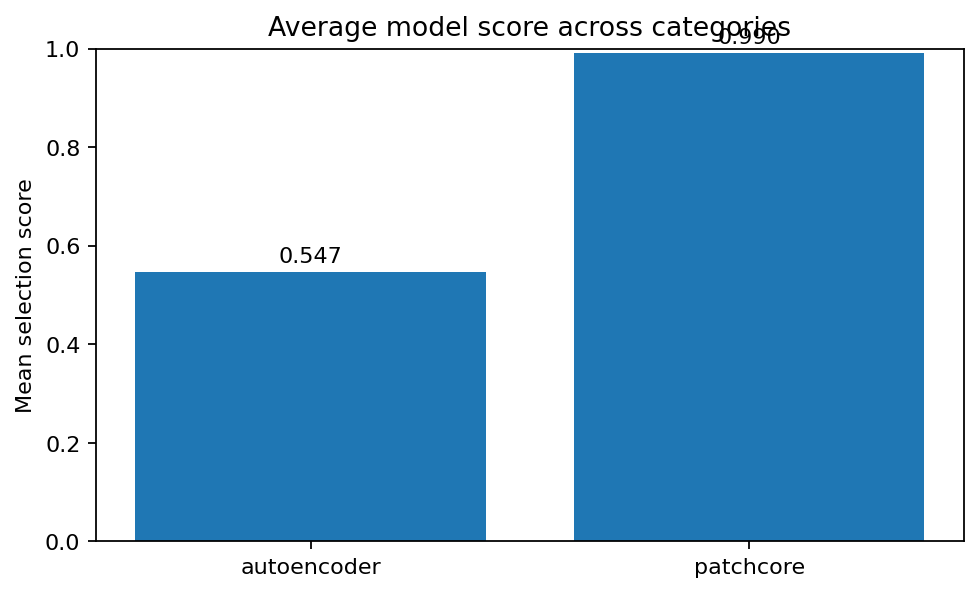

#### Category별 평균 accuracy

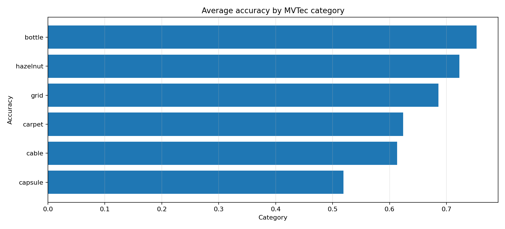

#### Category별 최고 모델

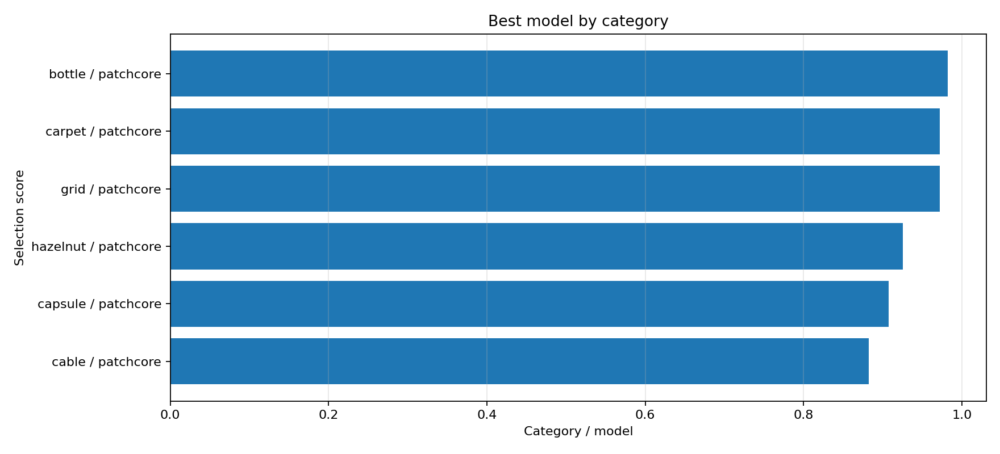

#### Category × Model selection score heatmap

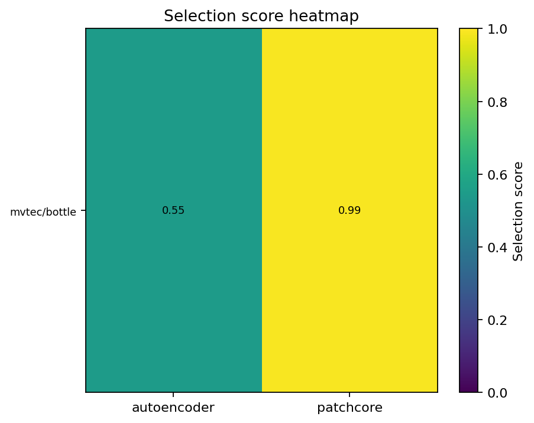

#### Category × Model accuracy 비교

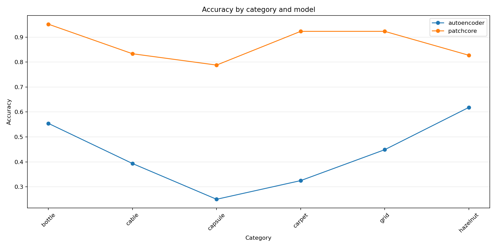

#### AutoEncoder validation loss 비교

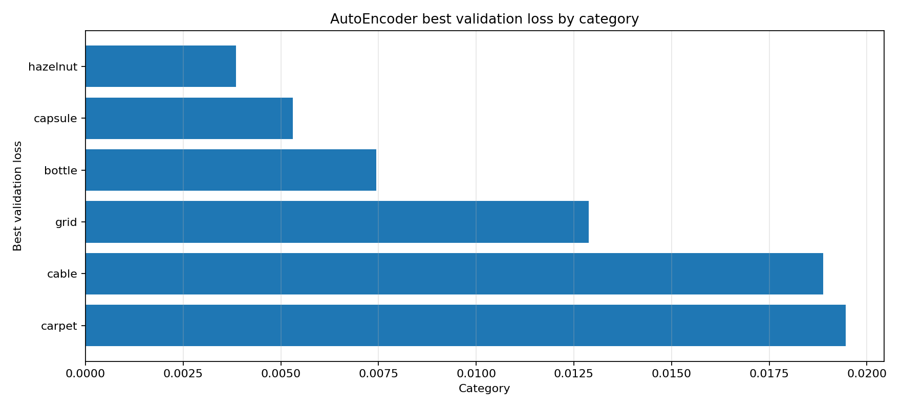

#### AutoEncoder best epoch 비교

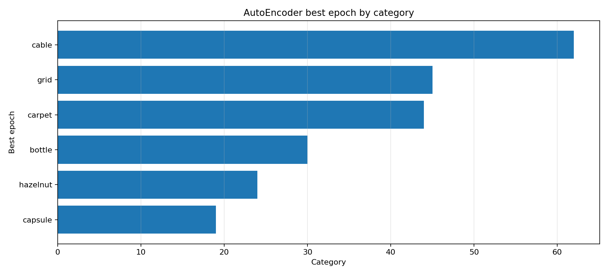

### 8.6 Heatmap sample

아래 이미지는 test image에 대해 원본 이미지, anomaly map, ground truth mask, heatmap overlay를 함께 저장한 예시이다.

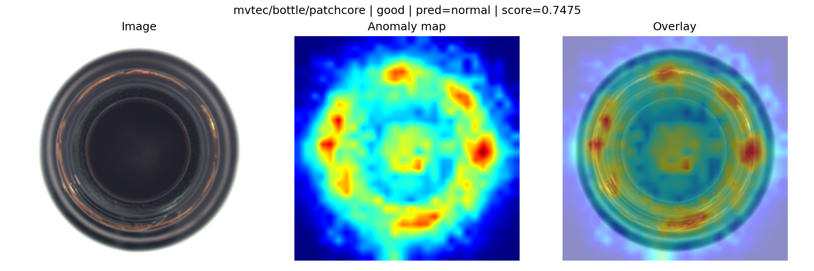

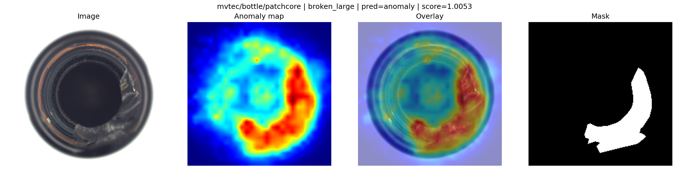

---

## 9. 학습 로그

### 9.1 AutoEncoder 학습 로그 요약

AutoEncoder는 category별로 train 정상 이미지 중 일부를 validation으로 분리하여 validation loss가 가장 낮은 epoch의 weight를 저장하였다. 모든 AutoEncoder 실험은 early stopping으로 종료되었다.

| Category | Final epoch | Best epoch | Best validation loss | Early stopped | Accuracy | F1 | AUROC |
|---|---:|---:|---:|---|---:|---:|---:|
| `bottle` | 34 | 30 | 0.007447 | True | 0.554 | 0.602 | 0.652 |
| `cable` | 66 | 62 | 0.018879 | True | 0.393 | 0.062 | 0.452 |
| `capsule` | 23 | 19 | 0.005311 | True | 0.250 | 0.208 | 0.507 |
| `carpet` | 48 | 44 | 0.019462 | True | 0.325 | 0.358 | 0.375 |
| `grid` | 49 | 45 | 0.012879 | True | 0.449 | 0.411 | 0.746 |
| `hazelnut` | 28 | 24 | 0.003856 | True | 0.618 | 0.571 | 0.862 |

### 9.2 학습 로그 예시

실제 Colab 학습 중 출력되는 로그는 다음과 같은 형식이다.

```text
epoch=003 train_loss=0.233878 val_loss=0.116877 best_val=0.116877 lr=5.00e-04 no_improve=0/4 *
epoch=004 train_loss=0.052527 val_loss=0.053736 best_val=0.053736 lr=5.00e-04 no_improve=0/4 *
epoch=005 train_loss=0.031602 val_loss=0.030653 best_val=0.030653 lr=5.00e-04 no_improve=0/4 *
```

### 9.3 저장된 로그 파일

| 파일 | 설명 |
|---|---|
| `docs/assets/results/all_results.csv` | 전체 category/model 평가 결과 |
| `docs/assets/results/leaderboard.csv` | selection score 기준 전체 순위 |
| `docs/assets/results/best_by_category.csv` | category별 최고 모델 |
| `docs/assets/results/model_summary.csv` | 모델별 평균 성능 |
| `docs/assets/results/category_summary.csv` | category별 평균 성능 |
| `docs/assets/results/autoencoder_history_summary.csv` | AutoEncoder 학습 요약 |
| `docs/assets/results/*.png` | README 및 Streamlit용 성능 시각화 이미지 |

---

## 10. Streamlit 데모 및 AWS EC2 배포

### 10.1 Streamlit 기능

`app/streamlit_app.py`는 다음 기능을 제공한다.

1. 성능 대시보드
   - 전체 평가 결과 표
   - category별 최고 모델 표
   - README용 성능 그래프 표시
2. 랜덤 이미지 추론
   - 학습에 사용하지 않은 test sample pool에서 category별 랜덤 이미지 10개 선택
   - 사용자가 이미지 1장을 선택하면 정상/불량 예측 수행
   - anomaly score, threshold, heatmap, overlay 표시
3. 배포 파일 상태 확인
   - deploy root, model registry, sample manifest, 모델 파일 존재 여부 확인

### 10.2 배포 구조

```text
EC2
├── DefectVision-AD-Proj/              # GitHub repository clone
│   ├── app/streamlit_app.py
│   ├── src/
│   ├── docs/assets/results/
│   └── requirements-ec2.txt
└── deploy/                            # Google Drive deploy bundle 압축 해제
    ├── model_registry.json
    ├── demo_samples_manifest.json
    ├── demo_samples/
    └── models/
```

### 10.3 실행 명령 예시

```bash
git clone https://github.com/wnstjq0915/DefectVision-AD-Proj.git
cd DefectVision-AD-Proj

python3 -m venv .venv
source .venv/bin/activate
pip install --upgrade pip
pip install -r requirements-ec2.txt

export DEFECTVISION_DEPLOY_ROOT="$HOME/DefectVision-AD-Proj/deploy"
python -m streamlit run app/streamlit_app.py \
  --server.address=0.0.0.0 \
  --server.port=8501 \
  --server.headless=true
```

인바운드 규칙을 열기 어려운 경우에는 Cloudflare Quick Tunnel 등 outbound tunnel을 이용하여 임시 URL을 생성할 수 있다.

---

## 11. 코드 구조

최종 프로젝트 구조는 다음과 같다.

```text
DefectVision-AD-Proj/
├── README.md
├── requirements.txt
├── requirements-ec2.txt
├── configs/
│   ├── dataset.yaml
│   ├── model_autoencoder.yaml
│   └── model_patchcore.yaml
├── data/
│   └── README.md
├── notebooks/
│   ├── 00_colab_env_dataset_manifest.ipynb
│   ├── 01_colab_train_eval_all_mvtec_categories_resume.ipynb
│   └── 02_colab_make_streamlit_bundle_and_push.ipynb
├── src/
│   ├── config.py
│   ├── datasets/
│   │   ├── mvtec_dataset.py
│   │   └── visa_dataset.py
│   ├── models/
│   │   ├── autoencoder.py
│   │   └── patchcore_wrapper.py
│   ├── preprocessing/
│   │   └── transforms.py
│   ├── train.py
│   ├── evaluate.py
│   ├── inference.py
│   └── visualize.py
├── app/
│   └── streamlit_app.py
├── docs/
│   ├── project_plan.md
│   ├── experiment_report.md
│   └── assets/results/
├── scripts/
│   ├── run_streamlit.sh
│   └── defectvision-streamlit.service
└── outputs/
    ├── checkpoints/
    ├── heatmaps/
    ├── metrics/
    └── figures/
```

### 11.1 주요 코드 역할

| 파일 | 역할 |
|---|---|
| `src/datasets/mvtec_dataset.py` | MVTec AD 폴더 구조 로딩, label/mask 생성 |
| `src/preprocessing/transforms.py` | 이미지 resize, normalize, augmentation, mask 처리 |
| `src/models/autoencoder.py` | Conv AutoEncoder 모델 및 reconstruction error map |
| `src/models/patchcore_wrapper.py` | ResNet18 기반 PatchCore-style memory bank 모델 |
| `src/train.py` | 기본 학습 함수 |
| `notebooks/01_colab_train_eval_all_mvtec_categories_resume.ipynb` | 최종 실험용 정밀 학습, resume, 평가, 시각화 생성 |
| `src/evaluate.py` | Accuracy, Precision, Recall, F1, AUROC, Pixel AUROC 계산 |
| `src/inference.py` | checkpoint 로드, 단일 이미지/폴더 추론 |
| `src/visualize.py` | anomaly map, heatmap, overlay 이미지 생성 |
| `app/streamlit_app.py` | EC2 배포용 웹 데모 |

---

## 12. 프로젝트 한계와 개선 방향

### 12.1 한계

- 전체 MVTec AD 15개 category 중 6개 category만 최종 실험에 사용하였다.
- VisA 데이터셋은 프로젝트 확장 대상으로 코드 구조에는 고려했으나 최종 성능 비교에는 포함하지 않았다.
- inference time은 정량 성능표에 포함하지 않고, 배포 데모에서의 실시간 동작 가능성 중심으로 확인하였다.
- AutoEncoder는 단순 reconstruction 기반이라 일부 category에서 recall이 낮았다.
- PatchCore는 성능이 높았지만 memory bank 기반이라 모델 파일과 추론 비용이 커질 수 있다.

### 12.2 개선 방향

- MVTec AD 전체 15개 category로 실험 확장
- VisA dataset까지 포함한 cross-dataset 비교
- PaDiM, FastFlow 등 추가 모델 비교
- inference time, memory usage, model size까지 포함한 배포 관점 평가
- threshold를 p95 고정이 아니라 validation set 기반 F1 최적화 방식으로 개선
- Streamlit에서 사용자가 직접 이미지를 업로드하여 추론하는 기능 추가

---

## 13. PDF 제출 방법

본 README는 GitHub에서 그대로 열어 PDF로 저장할 수 있도록 작성하였다.

1. GitHub repository에서 `README.md` 페이지 열기
2. 브라우저 메뉴 또는 단축키로 인쇄 실행
   - Chrome: `Ctrl + P`
   - macOS: `Cmd + P`
3. 대상 프린터를 `PDF로 저장`으로 선택
4. 배경 그래픽 옵션을 켜면 badge와 이미지가 더 잘 보인다.
5. Mermaid diagram이 보이지 않는 경우 GitHub 렌더링이 완료된 뒤 다시 인쇄한다.

---

## 14. 참고 자료

- MVTec AD 공식 페이지: https://www.mvtec.com/research-teaching/datasets/mvtec-ad
- PyTorch 공식 문서: https://pytorch.org/docs/stable/index.html
- TorchVision Models: https://pytorch.org/vision/stable/models.html
- OpenCV 공식 문서: https://docs.opencv.org/
- Streamlit 공식 문서: https://docs.streamlit.io/
- PatchCore 논문: Roth et al., “Towards Total Recall in Industrial Anomaly Detection”, CVPR 2022

---

## 최종 결론

본 프로젝트는 MVTec AD의 6개 category를 대상으로 AutoEncoder와 PatchCore-style 모델을 비교하였다. 실험 결과, 모든 category에서 PatchCore가 가장 높은 selection score를 보였으며, 평균 selection score 기준으로도 PatchCore가 AutoEncoder보다 우수했다. 특히 PatchCore는 image-level AUROC와 pixel-level AUROC 모두 높아 단순 정상/불량 분류뿐 아니라 결함 위치 시각화에도 적합했다.

따라서 최종 배포 모델은 category별 PatchCore checkpoint를 사용하며, Streamlit 웹 페이지에서는 사용자가 category와 test 이미지를 선택하면 정상/불량 판정과 heatmap overlay 결과를 확인할 수 있도록 구현하였다.
